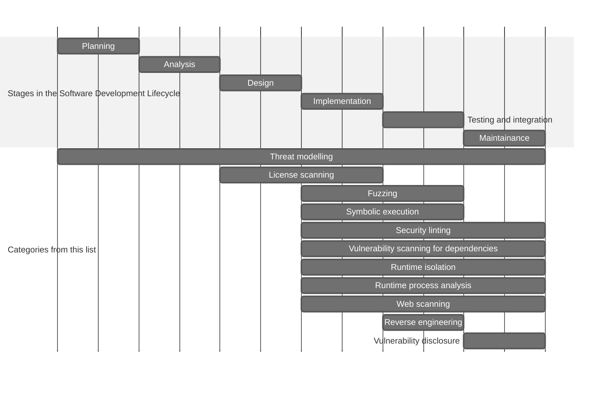

# Awesome AppSec in Ubuntu 

## Description

Ubuntu, a mature and user-friendly Linux distribution, is used by developers and security communities alike. Its appeal also lies in the ease of installing handy tools. We have two main software distribution channels:

- [Ubuntu archive](https://packages.ubuntu.com): If software is embraced by Ubuntu or Debian because of its maturity and usefulness, it's distributed as a Debian package. Given the slow release cycle, you can expect only stable versions here. However, it's a double-edged sword - you might miss out on the latest features introduced by the upstream.
- [Snap Store](https://snapcraft.io): Here's where anyone can play! By simply wrapping your software in a self-contained [snap](https://snapcraft.io/about), you can publish it in the Snap Store. With no restrictions on release cycles, maintainers can publish new versions at their own pace.

We've curated this [open](#contributions) list of awesome tools that:

- Assist anyone working with code to ensure or improve the security of a codebase; and
- Can be easily installed on Ubuntu, either from the Ubuntu Archive or the Snap Store.

## Categories

The tools were meticulously grouped into categories. To make things more visual, the following diagram outlines each category and how it could potentially fit into your software development lifecycle.

## Tools

### Coordinated vulnerability disclosure

- [cvelib](https://packages.ubuntu.com/search?suite=all&searchon=names&keywords=cvelib) (package) - CLI tool and Python library for communicating with the CVE Services API.

### Fuzzing

- [AFL++](https://packages.ubuntu.com/search?searchon=sourcenames&keywords=aflplusplus) (package) - Coverage-based fuzzer with compile-time instrumentation and QEMU emulation.

### License scanning

- [Trivy](https://snapcraft.io/trivy) (snap) - License scanner and opinionated risk assessor.

### Reverse engineering

- [Capstone](https://packages.ubuntu.com/search?searchon=sourcenames&keywords=capstone) (package) - Disassembly framework supporting 20+ architectures.
- [Ghidra](https://snapcraft.io/ghidra) (snap) - Reverse engineering framework with disassembly, assembly, decompilation, graphing, and scripting capabilities.
- [MobSF](https://snapcraft.io/mobsf) (snap) - Android and IOS security assessment platform, both static and dynamic.
- [radare2](https://snapcraft.io/radare2) (snap) - Reverse engineering toolkit with disassamblers, debuggers, and emulators.

### Runtime isolation

- [AppArmor](https://packages.ubuntu.com/search?searchon=sourcenames&keywords=apparmor) (package) - Linux security module implementing a MAC policy to limit the capabilities of an application.
- [Landlock](https://manpages.ubuntu.com/manpages/noble/en/man7/landlock.7.html) (OS feature) - Linux LSM implementing access control for unprivileged processes.
- [Kernel Lockdown](https://manpages.ubuntu.com/manpages/noble/man7/kernel_lockdown.7.html) (OS feature) - Linux kernel feature to prevent unauthorized access or modification to the kernel image or sensitive data from the kernel memory.
- [Snapcraft](https://snapcraft.io/snapcraft) (snap) - Toolkit for creating snaps, namely cross-distro packages that are self-contained using the AppArmor LSM.

### Runtime process analysis

- [nsntrace](https://snapcraft.io/nsntrace) (snap) - Network tracer for processes, with `.pcap` exports.
- [Valgrind](https://snapcraft.io/valgrind) (snap) - Memory management and thread error detector.

### Security linting

- [Bandit](https://snapcraft.io/bandit) (snap) - Python static code analyser.
- [Brakeman](https://snapcraft.io/brakeman) (snap) - Static vulnerability scanner for Ruby on Rails.
- [Clippy](https://packages.ubuntu.com/search?suite=all&searchon=names&keywords=rust-clippy) (package) - Rust linter with safety checks
- [cppcheck](https://snapcraft.io/cppcheck) (snap) - C/C++ static code analyser.
- [frawfinder](https://snapcraft.io/flawfinder) (snap) - C/C++ static code analyser.
- [gosec](https://snapcraft.io/gosec) (snap) - Go static code analyser.
- [govulncheck](https://snapcraft.io/govulncheck) (snap) - Go static code analyser.
- [Ruff](https://snapcraft.io/ruff) (snap) - Python linter with security-oriented rules.
- [semgrep-rules-manager](https://snapcraft.io/semgrep-rules-manager) (snap) - Downloader of third-party Semgrep rules.
- [Semgrep](https://snapcraft.io/semgrep) (snap) - Static analysis engine for finding bugs and querying the code in 30+ programming languages.
- [ShellCheck](https://snapcraft.io/shellcheck) (snap) - Static doe analyser for shell scripts.

### Symbolic execution

- [KLEE](https://snapcraft.io/klee) (snap) - Symbolic execution VM using LLVM.

### Threat modelling

- [OWASP Threat Dragon](https://snapcraft.io/threat-dragon) (snap) - Threat modelling platform.

### Vulnerability scanning for dependencies

- [cargo-auditable](https://packages.ubuntu.com/search?suite=all&keywords=cargo-auditable&searchon=names) - Tool for embedding the dependency tree in Rust-based executables, which can be later scanned for vulnerabilities.
- [depsdev](https://snapcraft.io/depsdev) (snap) - deps.dev client for fetching details such as dependencies, licenses, advisories, and critical health.
- [OSV-Scanner](https://snapcraft.io/osv-scanner) (snap) - Vulnerability scanner for projects' lists of dependencies.
- [Trivy](https://snapcraft.io/trivy) (snap) - Vulnerability scanner for SBOM.

### Web scanning

- [OWASP Zed Attack Proxy](https://snapcraft.io/zaproxy) (snap) - Extensible web app scanner.
- [sublist3r](https://packages.ubuntu.com/search?searchon=sourcenames&keywords=sublist3r) (package) - Subdomain enumeration tool by using OSINT or bruteforce.
- [wfuzz](https://packages.ubuntu.com/search?searchon=sourcenames&keywords=wfuzz) (package) - Fuzzer for any field of an HTTP request.

## Contributions

Do you use Ubuntu for software development or security? Ever discovered an awesome software security tool that can be swiftly installed on Ubuntu via `apt` or `snap`, yet it's missing from this list? We'd love to hear about it!

Just follow [the contribution guide](CONTRIBUTING.md) and we'll gladly add it to this list. Your contribution could be the missing piece in someone else's Ubuntu journey. Let's collaborate and make our Ubuntu toolset even better, one addition at a time!

